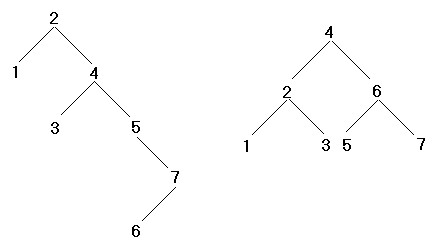
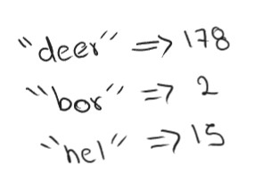
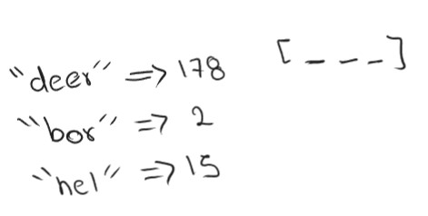
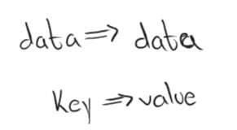

<h1 align="center">Basic Concepts</h1>

<h2>Binary search trees (BST)</h2>

	First, it is necessary to understand the function of these trees. We recall that a tree is a type of acyclic graph, DAG (directed acyclic graph).
	 
	

	<h3>Binary trees </h3>
	Binary trees are those where each node can have only two children, being node on the left and another node on the right. Therefore, each node that has children is known as a parent node, while nodes that do not have children are known as leaf nodes. Therefore, it should be understood that each node can have 0, 1, or 2 children. Every binary tree will always start with a parent node that lacks a parent, and this type of node is known as a root node.
	 
	One important thing that can be observed here is that the number of children will grow exponentially, such that it will continue to grow (according to its height) by powers of 2, again everything revolves around the number 2.
	Binary trees have different applications, such as those known to perform searches or other functions, such as being complete or balanced.
	
  
	In general, the construction of a binary tree has a very important property, taking into account that for the beginning of a tree there is a father which will be the root node, from here the following nodes are called children. Such that the children will be fulfilling the following property: the nodes stored in the left branch are less than the parent node, while the nodes stored in the right branch of the parent are greater than the parent, of course, this refers to numerical values.
	  
	Example:
	 
	
 

	 
	From this data structure, we can search for a specific value, for this, it will only be necessary to go following the property discussed above where we will start from the root, and from there we will begin to make comparisons so that if the value sought is less or greater than the value of the node in which we are currently we will know whether to go to the left or to the right. So if we find the number we return it, otherwise, if we reach the leaf nodes and the value still does not match then we deduce that the number is not within the structure.
	  
	This search application will help us to efficiently find several values that we need to store so that the searches will be performed with logarithmic complexity. Therefore, by contemplating this application it is possible to derive another application through it to be able to find values that are related to another value in some way, so it will not only be numbers that can be stored in the nodes but it is also allowed to have other types of data, even structures created by ourselves.
	This allowed us to see that we can search for a certain type of data based on another type of data provided, which ultimately boils down to access a type of data using a key that is associated with that type of data that we want to access:
	 
	
<table class="default">
	<tr>
    <td>Key</td>
    <td>Value</td>
	</table>
 <nr>
	And this finally can be understood as an associative array that will be allowing me to link a data type with another data type and thus perform searches and store efficiently the different data that are obtained during the execution of our program. In this way, we start with the concept of Map and Set.
	   
	<h2>Heap</h2>
	
 
	The idea is based on a heap graph, which is actually a special type of tree. This type of tree is based on a binary tree, like the one presented above. However, the heap implementation makes use of a full binary tree, its definition being that every level of the tree is filled. An important note is that if the lower level is not filled all the vertices must be as far to the left as possible, therefore it will be considered a complete binary tree even if the lower level is not filled but it is still considered to be always filled from left to right.   
	Therefore, since this property is always being filled from left to right and they are powers of 2, it is possible to store a binary tree in a single array, being in c++, to store it in a vector (dynamic array).
	Such that we will be able to map (project or store a value by means of another one) using the indexes of the vector starting from 1 to n, to later store in each position the type of data of interest. The calculation of each position to store each node will be done as follows:
	Suppose one is at position 'i', the parent node will be located at position i/2, its left child will have position 2i, and its right child will have a position 2i+1.
	It is from this that it is observed that it is not possible to start the index from 0, therefore when you want to define an amount of memory to use, it will be n+1. Where n is the number of nodes.   
	<h2>Hash Table</h2>
	
 
	Hash tables are structures that allow us to perform relationships or associations at the time of data pairs, such that we will be storing a key-value pair. As such, these structures are extremely powerful due to the fact that they allow us to access determiner values using a key, such that the key is associated only with that value.
	  
	
 

	 
	Hash tables support the following operations: 
	<ol>
	<li>Insertion</li>
	<li>Delete</li>
	<li>Search</li>
	</ol> 
	The important thing is that it is possible to perform these operations with a constant time complexity, so we can search for keys and access elements, or insert and even delete pairs of keys and data in constant time. Having a spatial complexity of linear size, due to the amount of data to be stored in the structure.  
	These structures are represented in different programming languages, such as python (dictionaries), javascript (object), c++ as unordered_maps/set. 
	If we explore a little the implementation of the hash tables we will realize that the way to perform these operations will be based on a hash function, which will give us the ability to transform the key we have into a number, this being an index to be able to store it in an array, we can understand this as follows.  
	
 

	  
	Thus, by obtaining these different indexes, it will be possible to perform these operations constantly, so it is possible to apply the theory seen for arrays. However, as we know, it is possible for collisions to occur between the creation of the indexes, so that repeated indexes can be obtained for different keys. This leads us to have linked lists in each position of the array, so that when having collisions what will be done is simply to save those values within the linked list that corresponds to the index obtained, so it is important that the value is still associated with its key so that when searching within the list can distinguish between the different keys we have and the searched one.  
	The problem with this is that this search can eventually be reduced to a worst-case linear time complexity, since we can have a case where all the keys collide, making us go from a constant complexity to a linear one. However, in real life, we have very powerful hash functions with which we can practically forget about this worst case and rely on always having constant operations. There is also the concept of resizing that allows us to resize the array size and still have constant complexity in time and linear in space. 
	It is thanks to these powerful hash functions that convert the key into an index that we can use to map the value. They allow us to use virtually any type of structure as a key, so we can say the following:
	  
	
 

