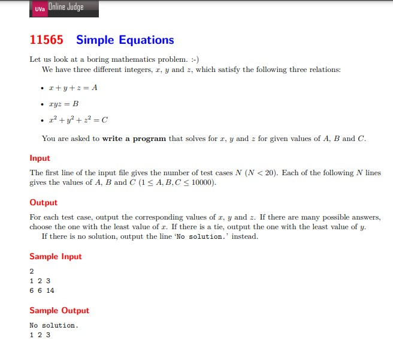
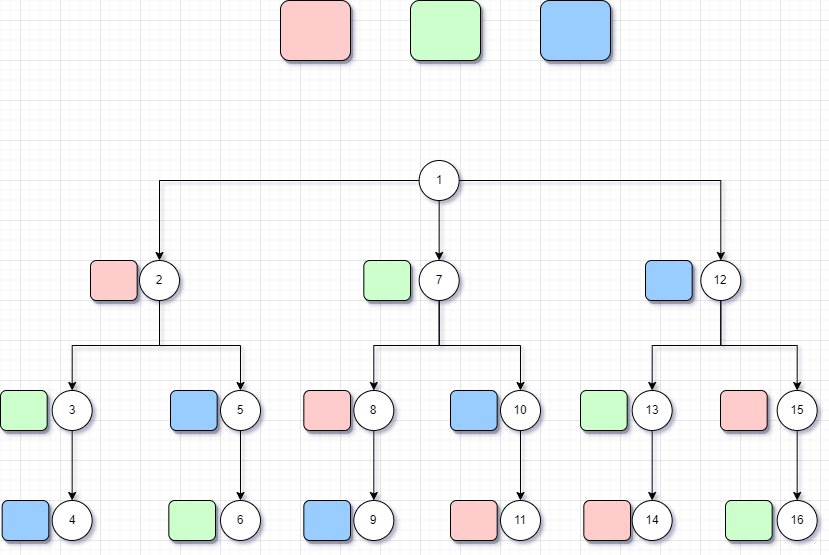
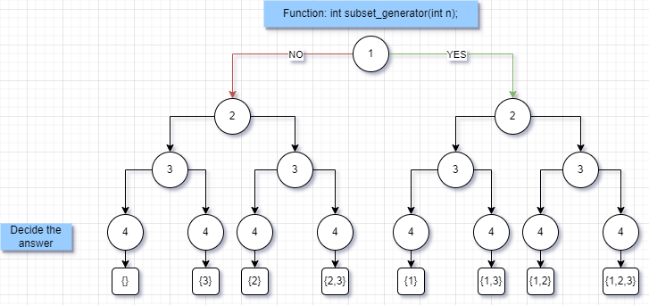
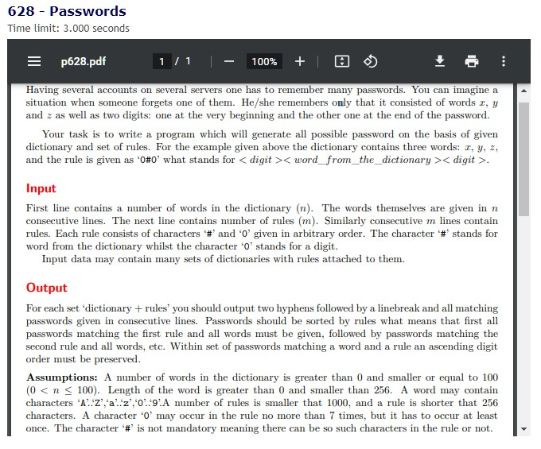

<h1 align=center>Complete Search</h1>

<p>
	The idea is to generate all possible solutions using brute force, and then count or select the correct solutions.
	<br><br>
	When choosing this type of solutions you have to have enough time to go through all the possible solutions. It is easy to implement and always the correct answer.
	The concept of complete search is to go through the entire array or whatever you have, so that you must find all possible solutions, and after finding solutions you must choose those that meet the constraints.
	<br><br>
	<h3>Example</h3>
	<hr>
	
	<br><br>
	Code:<br><br>
	

```c++
#include <bits/stdc++.h>
using namespace std;

	// Se debe de hacer un despeje de la �ltima ecuaci�n proponiendo x=1 y y=2 C =10000

	void solve(int A,int B,int C)
	    {
	        for(int x=-100;x<=100;x++)
	            {
	                for(int y=-100;y<=100;y++)
	                    {
	                        for(int z=-100;z<=100;z++)
	                            {
	                                if(x!=y && y!=z && x!=z)
	                                    {
	                                        if((x+y+z)==A)
	                                            {
	                                                if((x*y*z)==B)
	                                                    {
	                                                        if(((x*x)+(y*y)+(z*z))==C)
	                                                            {
	                                                                cout<<x<<" "<<y<<" "<<z<<endl;
	                                                                return;
	                                                            }
	                                                    }
	                                            }
	                                    }
	                            }
	                    }
	            }
	        cout<<"No solution."<<endl;
	        return;
	    }


	int main() {
	    
	    int t; cin>>t;
	    int A,B,C;
	    
	    for(int i=0;i<t;i++)
	        {
	            cin>>A>>B>>C;
	            solve(A,B,C);
	        }
	    
		return 0;
	}
```
<br><br>

<h2>Backtracking</h2>
<hr><br>
	To understand backtracking you must understand the name, which in short would mean a backtracking, that is to say that to find the solution it is necessary to go back to find a correct solution, normally it should be represented as a tree, a tree of decisions.
<br><br>

<br><br>
The representation is made in a decision tree to give each answer and it is because each branch gives a different answer. So, for example in the previous drawing a decision tree is represented that represents the different ways that exist to accommodate three colors, here there are no restrictions yet, therefore all the possible ways must be counted.
<br><br>
One thing that is necessary to observe is that the search for the solution will stop when you already have the 3 colors or seen in another way, when the depth is 4.
Then, once a solution is reached, it is assumed that there is more than one, so it is necessary to go back to the previous node to explore the branch that had not been chosen previously. And the way to perform this backtracking is by means of recursion, recursion will be necessary to be able to go deeper in each node and also an iterative cycle will be useful to explore and choose another branch. When making a new decision it will be necessary to check if this choice meets the requirements to call it a solution.
<br><br>
<h3>Example - Subsets</h3>
<hr><br>

<br><br>
Code:<br><br>

```c++
	#include <bits/stdc++.h>
	using namespace std;

	void backtrack(int t,int number,vector<int> &solution)
	    {
	        // Caso base
	        if(number == t)
	            {
	                for(auto it: solution)
	                    cout<<it;
	                cout<<endl;
	                return;
	            }
	        
	        // Tomar número - izquierda
	        solution.push_back(number+1);
	        backtrack(t,number+1,solution);
	        
	        // No tomarlo - derecha
	        solution.pop_back();
	        backtrack(t,number+1,solution);
	    }

	int main() {
	    
	    int t;  cin>>t;
	    vector<int> solution;
	    //Subsets:
	    backtrack(t,0,solution);
	    
		return 0;
	}
```

<br><br>

<h3>Exercise</h3>
<hr><br>

<br><br>


```c++
	Input:
	2
	root
	2super
	1
	#0
	1
	admin
	1
	#0#

	
	Output:
	--
	root0
	root1
	root2
	root3
	root4
	root5
	root6
	root7
	root8
	root9
	2super0
	2super1
	2super2
	2super3
	2super4
	2super5
	2super6
	2super7
	2super8
	2super9
	--
	admin0admin
	admin1admin
	admin2admin
	admin3admin
	admin4admin
	admin5admin
	admin6admin
	admin7admin
	admin8admin
	admin9admin
```

	
</p>
