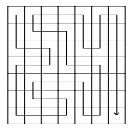

<h1 align=center>Complete Search</h1>

<p>
	The idea is to generate all possible solutions using brute force, and then count or select the correct solutions.
	<br><br>
	When choosing this type of solutions you have to have enough time to go through all the possible solutions. It is easy to implement and always the correct answer.
	The concept of complete search is to go through the entire array or whatever you have, so that you must find all possible solutions, and after finding solutions you must choose those that meet the constraints.
	<br><br>
	<h3>Example</h3>
	<hr>
	
	<br><br>
	Code:<br><br>
	

```c++
#include <bits/stdc++.h>
using namespace std;

	// Se debe de hacer un despeje de la �ltima ecuaci�n proponiendo x=1 y y=2 C =10000

	void solve(int A,int B,int C)
	    {
	        for(int x=-100;x<=100;x++)
	            {
	                for(int y=-100;y<=100;y++)
	                    {
	                        for(int z=-100;z<=100;z++)
	                            {
	                                if(x!=y && y!=z && x!=z)
	                                    {
	                                        if((x+y+z)==A)
	                                            {
	                                                if((x*y*z)==B)
	                                                    {
	                                                        if(((x*x)+(y*y)+(z*z))==C)
	                                                            {
	                                                                cout<<x<<" "<<y<<" "<<z<<endl;
	                                                                return;
	                                                            }
	                                                    }
	                                            }
	                                    }
	                            }
	                    }
	            }
	        cout<<"No solution."<<endl;
	        return;
	    }


	int main() {
	    
	    int t; cin>>t;
	    int A,B,C;
	    
	    for(int i=0;i<t;i++)
	        {
	            cin>>A>>B>>C;
	            solve(A,B,C);
	        }
	    
		return 0;
	}
```
<br><br>

<h2>Backtracking</h2>
<hr><br>
	To understand backtracking you must understand the name, which in short would mean a backtracking, that is to say that to find the solution it is necessary to go back to find a correct solution, normally it should be represented as a tree, a tree of decisions.
<br><br>

<br><br>
The representation is made in a decision tree to give each answer and it is because each branch gives a different answer. So, for example in the previous drawing a decision tree is represented that represents the different ways that exist to accommodate three colors, here there are no restrictions yet, therefore all the possible ways must be counted.
<br><br>
One thing that is necessary to observe is that the search for the solution will stop when you already have the 3 colors or seen in another way, when the depth is 4.
Then, once a solution is reached, it is assumed that there is more than one, so it is necessary to go back to the previous node to explore the branch that had not been chosen previously. And the way to perform this backtracking is by means of recursion, recursion will be necessary to be able to go deeper in each node and also an iterative cycle will be useful to explore and choose another branch. When making a new decision it will be necessary to check if this choice meets the requirements to call it a solution.
<br><br>
<h3>Example - Subsets</h3>
<hr><br>

<br><br>
Code:<br><br>

```c++
	#include <bits/stdc++.h>
	using namespace std;

	void backtrack(int t,int number,vector<int> &solution)
	    {
	        // Caso base
	        if(number == t)
	            {
	                for(auto it: solution)
	                    cout<<it;
	                cout<<endl;
	                return;
	            }
	        
	        // Tomar número - izquierda
	        solution.push_back(number+1);
	        backtrack(t,number+1,solution);
	        
	        // No tomarlo - derecha
	        solution.pop_back();
	        backtrack(t,number+1,solution);
	    }

	int main() {
	    
	    int t;  cin>>t;
	    vector<int> solution;
	    //Subsets:
	    backtrack(t,0,solution);
	    
		return 0;
	}
```

<br><br>

<h3>Exercise</h3>
<hr><br>

<br><br>


```c++
	Input:
	2
	root
	2super
	1
	#0
	1
	admin
	1
	#0#

	
	Output:
	--
	root0
	root1
	root2
	root3
	root4
	root5
	root6
	root7
	root8
	root9
	2super0
	2super1
	2super2
	2super3
	2super4
	2super5
	2super6
	2super7
	2super8
	2super9
	--
	admin0admin
	admin1admin
	admin2admin
	admin3admin
	admin4admin
	admin5admin
	admin6admin
	admin7admin
	admin8admin
	admin9admin
```

<<<<<<< HEAD
<br><br>
<h2>Two ways to obtain the solution</h2>
<hr><br>
We will illustrate this section with the following problem:
<br>

<br><br>
In this problem, we just have to understand that the key is to obtain a number such that its digits are all different. Therefore, it is possible to obtain a solution in two ways:<br>
<ol>
<li>Filtering</li>
<li>Generating</li>
</ol><br>
<h2>Filtering</h2>
Solution filter - construction by iterative form.
So, one way to do this is by an iterative means, and this way is called "filtering" the solutions, it is nothing more than first generate all the solutions and then choose those that are viable or not, in other words it will be first generate a solution and then choose whether that solution is viable or not and this can be easily seen in the exercise of "Division" where we will generate each solution and then filter those solutions, that is I will be generating each numerator to then see if all the numbers in that numerator are different, and here we are applying this filtering the solution.<br><br>
<h2>Generating</h2>
This is another way, and it is that at the moment of constructing our solution, for each step we see if it is convenient to place that number or not, and so on until the solution is built. Then we observe each step. For example, if I had applied this strategy instead of choosing the iterative one, what I would have to do is first to generate each number, to see that each number is different from each other, so that the result should be that when dividing it by fghij it gives k. But the latter is more difficult to do by this means because it must be ensured that the generated number is a solution. 
It is for this last reason that two things must be considered
<br><br>
<ul>
<li>Analyze which strategy to use, if it is more convenient to use a filtration or a solution generator. The next thing will be to implement it.</li>
<li>The other thing is to see if the pruning can be implemented or not.</li>
</ul>
<br>
This last point is where the pruning of the solutions comes in, because when performing a complete search it should be seen as a tree where each branch gives us a different function so that in the end it gives us a result, then pruning leaves would be to discard all those branches that do not lead us to a correct result. This has a great effect on the efficiency of the algorithms.
<br><br>
<h3>Example!</h3>
in the 8 queens problem it will not make sense to continue and finish the whole solution when we see that the second queen is colliding with the first queen, then it quickly follows that placing a third queen would not make any difference since the second queen has already made the whole solution wrong, so instead of finishing processing that incorrect solution directly we can discard that solution and try another one.
<br><br>
<div align="center">
<br><br>
</div>
<div align="center">
<br><br>
</div>
This is how to prune the solution. In this picture, we can see the different ways to put a queen, but in some places, it is not valid because the queens are attacking themselves. So what is the point of continuing with an invalid solution? There is no point in doing so, but in the native backtracking solution that is not important and so we can easily forget about it. The point of pruning a solution is to add intelligence to the solution. In this case, we can think of the following:
"If I put a queen and that place is invalid, I can stop the search there and start another solution somewhere else". 
<br><br>


```c++
#include <bits/stdc++.h>
using namespace std;
// Explicación en github.

int numero_reinas;

// Dimensiones del tablero se podría resumir en una sola variable, pero bueno:
int n_columnas = 0;
int n_renglones;

// Contador de soluciones
int soluciones=0;

// Reinas almacenadas.
vector<int> reinas(8, 0);     // La posición será columna y el valor a guardar es el renglón. 


// Valir si se puede colocar, para esto será revisando las columnas anteriores para ver si alguna choca.
bool colocar(int columna_actual, int renglon_actual)
    {
        // Comprobando las reinas anteriores no choquen con la actual:
        for(int columna_anterior = 0;columna_anterior<columna_actual;columna_anterior++)
            {
                if(reinas[columna_anterior] == renglon_actual || 
                   abs(reinas[columna_anterior] - renglon_actual) == abs(columna_anterior - columna_actual) )
                    {
                        return false;   // En caso que choque, entonces no se puede colocar.
                    }
            }
        return true;    // Si acaba el for, entonces nunca dio un false.
    }

void backtrack(int columnas)
    {
        // Caso base - Para romper 
        if(columnas == (n_columnas))
            {
                //cout<<"Solución encontrada";
                soluciones++;
                
                return;
            }
        
        // Recorrer cada renglón y en cada renglón probar si es posible colocarlo en la columna.
        // esto es para recorrer los nodos del árbol.
        for(int renglones=0;renglones<n_renglones;renglones++)
            {
                // Comprobando si se puede colocar, para esto se comprueba todas las columnas anteriores
                if(colocar(columnas,renglones))
                    {
                        // Sí se puede colocar, lo pongo como reina.
                        reinas[columnas] = renglones;
                        // Avanzo más en el árbol
                        backtrack(columnas+1);
                    }
            }
        
    }

int main() {
    
    //cin>>numero_reinas;     // Número de reinas.
    cin>>n_columnas;        //Dimesión del tablero.
    n_renglones = n_columnas;
    
    backtrack(0);       // Llamada.
    cout<<soluciones;
    
    return 0;
}

```

<br><br>
However, we can extrapolate that and prune more solutions.

Let's see another example. In this case, this example is from the handbook CSES. 
<br><br>

<h2>Example - Paths</h2>
Let us consider the problem of calculating the number of paths in an n × n
grid from the upper-left corner to the lower-right corner such that the path visits
each square exactly once. For example, in a 7 × 7 grid, there are 111712 such
paths. One of the paths is as follows:
<br><br>
<div align="center">
<br><br>
</div>
<br><br>
<h2>Basic algorithm</h2>
<hr><br>
<ul>
<li>running time: 483 seconds</li>
<li>number of recursive calls: 76 billion</li>
</ul><br><br>
<h2>Optimization 1</h2>
<hr><br>
First move one step down or right. There are always two
paths that are symmetric about the diagonal of the grid after the first step.<br><br>
<div align="center">
<br><br>
</div>
<ul>
<li>running time: 244 seconds</li>
<li>number of recursive calls: 38 billion</li>
</ul><br>
Just multiply the solution by 2.<br><br>
<h2>Optimization 2</h2>
<hr>
If the path reaches the lower-right square before it has visited all other squares
of the grid, it is clear that it will not be possible to complete the solution.<br><br>
<div align="center">
<br><br>
</div>
<ul>
<li>running time: 119 seconds</li>
<li>number of recursive calls: 20 billion</li>
</ul><br>
<h2>Optimization 3</h2>
<hr>
If the path touches a wall and can turn either left or right, the grid splits into
two parts that contain unvisited squares.<br><br>
<div align="center">
<br><br>
</div>
<ul>
<li>running time: 1.8 seconds</li>
<li>number of recursive calls: 221 million</li>
</ul><br>
<h2>Optimization 4</h2>
<hr>
The idea of Optimization 3 can be generalized: if the path cannot continue
forward but can turn either left or right, the grid splits into two parts that both
contain unvisited squares.<br>
<div align="center">
<br><br>
</div>
<ul>
<li>running time: 0.6 second</li>
<li>number of recursive calls: 69 million</li>
</ul><br>
<div align="center">
<h3>This is a usual phenomenon in backtracking, because the search tree is usually
large and even simple observations can effectively prune the search.</h3>
</div>
<br><br>
<h3>Code (without optimizations)</h3>
<br>

```c++
#include <bits/stdc++.h>
using namespace std;

int main() 
	{
		// your code goes here C:

		return 0;
	}

```

<hr>
<br><br><br>


<h2>Backtracking && Bits</h2>
In this section, we are only going to merge the concepts: bit manipulation and backtracking.<br><br>

Why? 
Well, we can take advantage of the fact that there are several applications where bits are present. One of them is the trick of storing digits in an integer. In this way, we can find other applications during the solutions.

<h3>Example</h3>
<br>
<div align="center">
<br><br>
</div>

```c++
Input:

5 3 1 3 4
10 4 9 8 4 2
20 4 10 5 7 4
90 8 10 23 1 2 3 4 5 7
45 8 4 10 44 43 12 9 8 2

Output:
1 4 sum:5
8 2 sum:10
10 5 4 sum:19
10 23 1 2 3 4 5 7 sum:55
4 10 12 9 8 2 sum:45

```

<br>
<div align="center">
<br><br>
</div>
<br>

All these solutions are possible. However, we have to choose the solution whose sum is almost n. In other words: "The difference is less than the other difference".
<br>

<h3>How can we save the tracks?</h3>

The solution is bit manipulation, the trick to store numbers in an integer using bitwise and bitmaks.
<br>

<br><br>
If int  = 32 bits and max(n) = 20, we can do 1<<20 into an integer.
<br>


```c++
#include <bits/stdc++.h>
using namespace std;
// Explicación en github.

// Objetivo, ocupar tantos tracks para que el espacio sea el más pequeño

int n;  // Espacio a minimizar, o sea maximizar el gasto del espacio
int n_tracks=0;
vector<int> tracks;

int minimo=0;

// Truco fancy de bist para guardar posiciones 
int b2;   // size in bits: 32


int menor=1e8;

bool sepuedeSumar(int gasto,int valor)
    {
        if( gasto-valor < 0)
            return false;
        else return true;
    }

int backtrack(int indice, int gasto, int sol)
    {
        
        // Caso base
        if(indice == tracks.size())
            {
                if(gasto<menor)
                    {
                        menor=gasto;
                        b2=sol;
                    }
                return gasto;
            }
        else
            {
                if(sepuedeSumar(gasto,tracks[indice]))
                    {
                        
                        //m=min(backtrack(indice+1,gasto-tracks[indice]), backtrack(indice+1,gasto));
                        // El mínimo es agregando
                        int a=backtrack(indice+1,gasto-tracks[indice],sol|(1<<indice));
                        int b=backtrack(indice+1,gasto,sol);
                        if(a<b)
                            {
                                return a;
                            }
                        else
                            {
                                // El mínimo es sin agregar.
                                
                                return b;
                            }
                        
                        
                    }
                else{
                    return backtrack(indice+1,gasto,sol);
                    
                }
            }
        
    }

int main()
    {
        while(scanf("%d",&n)!=EOF)
            {
                cin>>n_tracks;
                int aux;
                for(int i=0;i<n_tracks;i++)
                    {
                        cin>>aux; tracks.push_back(aux);
                    }
                minimo=backtrack(0,n,0);      // Lo que se regresa es el espacio restante.
                
                for(int i=0;i<n_tracks;i++)
                    {
                        if((b2>>i) %2)
                            cout<<tracks[i]<<" ";
                    }
                
                cout<<"sum:"<<n-minimo<<endl;
                tracks.clear();
                b2=0;   menor=1e8;
            }
        
        return 0;
    }
```

=======
	
>>>>>>> e1e24114a3b1a159ab488a14d22c81b2afe149cd
</p>
