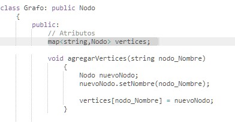

<h1> Map </h1>

El map, mapa, es un array asociativo cuya implementación está basada en un árbol binario balanceado de búsqueda (balanced BST).

El map nos va asociar una key con un valor, y su forma de realizar su declaración es la siguiente:

    map <key, value> name_map;

Es importante recordar que el tipo de llave y el valor que se puede colocar en nuestro mapa puede ser prácticamente cualquier tipo de dato que existe en C++. 
Un ejemplo, se podría tener como llave un vector el cual tenga en su interior varios números, o diferentes valores. 
Ejemplo el siguiente:

    map <vector<int> ,int> mapa;
    vector<int> v;
    cin>>a>>b>>c>>d>>f;
    
    v.push_back(a); v.push_back(b); v.push_back(c); v.push_back(d); v.push_back(f);
    
    sort(v.begin(),v.end());
    
    mapa[v] ++;
  
Durante la resolución de ejercicios el mapa puede usarse para contar el número de ocurrencias de un determinador valor, ya sea un número o String solo que se debe de 
tener en cuenta que estos valores deben estar en el mismo orden para que se pueda interpretar que se trata del mismo valor que apareció momentos anteriores:
  
    map<llave,valor> mapa;
    mapa[llave]++;
  
Esto mismo se observa en el caso anterior donde era usado un vector como llave, de modo que al ordenar es posible decir que usando un map se puede contar la cantidad
de ocurrencias de esos 5 números alojados en el vector.

Es posible sobrexplotar esta característica de llave al momento de proponer como "key's" clases:
  

<h2>Funciones en Map</h2>

<h3>Encontrar el máximo valor</h3>
Aunque esto podría realizarse al momento de ir obteniendo los datos, no siempre es posible así que una forma de obtener el máximo (valor, no llave) en un mapa es 
usando el algoritmo max() implementado por C++, de modo que tan solo se deberá de agregar una función booleana para modificar la comparación y así adaptarlo al mapa:

Función para realizar la comparación personalizada

Función fuera del main:

    bool compare(const pair<vector<int>, int>&a, const pair<vector<int>, int>&b)
        {
           return a.second<b.second;
        }

Función en el main:

    int maximo = max_element(mapa.begin(), mapa.end(), compare)->second;

<h3>Count</h3>
A pesar de lo que se puede llegar a pensar por el nombre de la función, esta no va a servir para poder contar cuántas veces aparece esa llave, sino que solo nos va 
ayudar para poder saber si una llave existe dentro del mapa. Por lo cual, lo que nos va a retornar dicha función será solo dos valores: 0 -> en caso 
que no esté, 1 -> en caso que sí esté.

    nombre_mapa.count(key);

<h3>Recorrer un mapa</h3>
Esto será por medio de iteradores

    for(auto it2: mapa)
	    cout<<it2.first<<” “<<it2.second<<endl;

