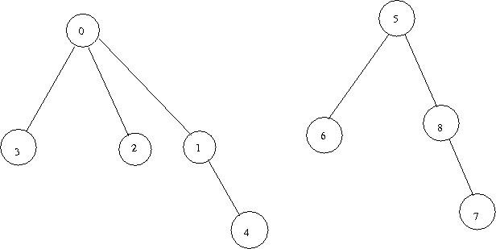
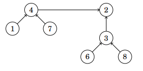

<h1> Union Find structure </h1>
<h2> Complejidad: 
      Union y Encontrar O(log(n)) </h2>

Union Find es una estructura de datos que mantiene una colección de conjuntos disjuntos, los conjuntos no pertenecen a más de un conjunto.

Entonces, esta estructura será para unir conjuntos los cuales pueden lucir de esta forma:

De aquí mismo se observa que hayh conjuntos en forma de vértices, como tipo sub grafos, entonces será posible realizar la unión de estos con la estructura y para realizar
esto es deberá de tener en cuenta que de cada conjunto va a existir un elemento que represente a dicho conjunto, en este caso dicho representante es el vértice que está 
más arriba, de modo que siguiendo el camino de cualquier vértice más abajo nos va a guiar hacia este representante. Por lo cual, dos conjuntos pueden ser unidos por 
medio de los representantes de cada conjunto.

 
<h2>Unión de conjuntos</h2>
Esto se realiza por medio de la unión de los representantes de los conjuntos, por lo cual será tan solo unir el representante de un conjunto a otro conjunto, lo 
siguiente será preguntarse sobre... 

¿De dónde a dónde se realiza la unión?
La estrategía planteada para esto será simplemente unir el representante de aquel conjunto con menor número de elementos con el representante del conjunto de mayor
número de elementos. De forma que quedará como representante el que tenga mayor número de elementos en su conjunto.

 

De modo que anteriormente se tenía al número 4 como representante de su conjunto y este se unió al representante 2 debido a que su conjunto tiene mayor cantidad de 
elementos.

<h2>Find</h2>
Al final del día podemos ver esto como una cadena de modo que al seguir esta estrategía podemos hacer que la longitud se conserve de log(n), y esto mismo nos da el
siguiente acercamiento que será encontrar el representante de un conjunto puesto que al ser de longitud log(n) tan solo debemos de seguir esa "cadena" o camino 
para encontrar el representante del conjunto haciendo que dicha operación también sea tiempo log(n).

 
<h2>Saber si dos elementos están en el mismo conjunto</h2>
Para saber esto será necesario ver el representante únicamente, si el representante de ambos elementos resulta ser el mismo entonces dichos elementos se encuentran 
en el mismo conjunto.

Esto mismo se entiende debido a que el representante tal cual será el que esté enfrente de todo el conjunto, por eso será lo único que se deberá de checar.

<h2>Implementación (Handbook programming competitive)</h2>
<h3>Declaración de vectores</h3>
Esta implementación consiste en primero realizar dos vectores, uno en donde se estarán almancenando los conjuntos y otro vector en donde indique para cada 
elemento representativo el tamaño de su correspondiente conjunto.

Entendiendo esto, el primer vector se podrá entonces ver de la siguiente manera:
            
            vector<int> cadenas;

De modo que, como se comentó anteriormente, los conjuntos se puede ver como una cadena (aristas) las cuales estén uniendo a otros elementos, en fin un grafo. Por lo
cual, se deberá de tener en cuenta que entonces esta cadena en sí se puede interpretar como la implementación de un grafo por medio de un arreglo, esto es debido 
a que al contener los elementos de los conjuntos la manera en que lo realizará será usando como llave un "elemento" y el resultado será el elemento al que está 
conectado, es por esto mismo que se dice que es una cadena de modo que siguiendo la cadena podemos encontrar facilmente el valor representativo y cuidando el tamaño
la complejidad deberá ser O(log(n)).

Entonces, este vector podría interpretarse de igual forma como una especie de mapa debido a la función que le estamos dando al final como un arreglo asociativo:
Supongamos que tenemos lo siguiente:
      4
     /
    /
   3
    \
     \
      \
       2
De modo que al tener nuestro vector de cadena y querer saber el representativo del elemento 2 se tendrá lo siguiente:

            next_element = chain[element];
            
            //Esto en términos de entender, puesto que una implementación real sería de la siguiente forma: 
            element = chain[element]; 
            
Entonces, tenemos que el vector cadena es para poder conocer el elemento que se tiene asociado al elemento actual, por lo cual lo siguiente será entender cómo es que
se iniciliza tal cosa, y es que en un inicio no tenemos ningún elemento unido puesto que todos se encuentran disjuntos y esto nos da a pensar que en sí el siguiente
elemento que le sigue al elemento es el mismo y esto cambiará conforma vayamos uniendo elemento. De aquí mismo podemos deducir que, entonces, el tamaño de cada 
conjunto será 1, y en un principio se tendrá que los representantes de los elementos son ellos mismos debido a que en un principio todos están disjuntos.
            
            // Declaración de los vectores
            vector<int> c; //Para las cadenas
            vector<int> s; //Tamaño de cada conjunto
            
            for(int i=1;i<=n_elements;i++) c[i] = i; // El representante en un inicio de cada conjunto es el mismo número.
            for(int i=1;i<=n_elements;i++) s[i] = 1; // El tamaño de cada conjunto es 1, debido a que está compuesto por el mismo cada conjunto en un inicio.
           
<h3> Find </h3>
Una vez con los elementos podemos hacer la función de Find, encontrar, y recordando lo visto anteriormente la manera de encontrar un conjunto será por medio de su 
representante así que al tener ya un vector cadena que me diga el siguiente elemento del elemento actual lo único que tengo que hacer es iterar sobre estos hasta 
llegar que el elemento actual sea igual al siguiente elemento, o sea:
            
            //Por ejemplo:
            3 == v[next_element]
            3 == 3
          
Cuando tenemos que el siguiente elemento es el mismo elemento actual significa que se ha llegado al representante debido a que el siguiente elemento o el elemento
asociado al representante es el mismo, si asumimos que la longitud de la cadena es O(log(n)) entonces esta función será de igual complejidad:

            int find(int element)
                  {
                        while(element != c[element])
                           element = c[element];
                        
                        return element;
                  }

Entonces, la función me estará regresando los representantes de cada conjunto.

<h3> IsSameSet </h3>
Como se comentó anteriormente, para distinguir entre un conjunto de otro será por medio de los representantes de modo que para saber si un elemento pertenece al mismo
conjunto que otro elemento bastará solo con confirmar que ambos elementos tienen el mismo representante y esto mismo se logra por medio de la función find().

            bool isSameSet(int a, int b)
                  {
                        return find(a)==find(b);
                  }

<h3> unionSet </h3>
Esta función será tal cual unir los conjuntos y la manera de hacer esto será uniendo a los representantes de los conjuntos deseados, por lo cual primera sería 
apropiado que se revise que ambos elementos en efecto correspondan a diferentes conjuntos y para esto se podrá usar la función isSameSet().

Lo siguiente a contemplar será encontrar los representantes de los conjuntos, esto es debido a que normalmente para unir dos conjuntos lo que nos darán será dos números, por lo cual deberemos encontrar los representantes de esos números dados ya que nada nos garantiza que dados esos dos números sean realmente los representantes y esto se logra por medio de la función fund().

Finalmente se deberá de hacer la comparación de los tamaños y esto es con el motivo de mantener pequeño la cadena (o grafo) y procurar una complejidad de O(log(n)), y para esto es que se usa el arreglo declarado en un inicio que era el tamaño de las cadenas, así que se deberá de hacer la unión del conjunto más pequeño se une con el conjunto que sea más grande. Para esto tendremos dos casos: el conjunto A es más grande o el conjunto B es más grande. Una vez encontrado realizado esto ya solo se necesitará de realizar la unión de estos y la forma de realizar la unión será precisamente con el arreglo de cadenas, el que me esté guardando la unión de los elementos.

            void unionSet(int a, int b){
                
                if(!isSameSet(a,b)){
                    
                    int rA = find(a);
                    int rB = find(b);
                    
                    if(s[rA] < s[rB]){
                       p[rA] = rB;  
                       s[rB] += s[rA];
                    }
                    else{
                       p[rB] = rA;  
                       s[rA] += s[rB];
                    }
                }
                return;
            }

Es posible hacer otras funciones las cuales derivan simplemente de las anteriores realmente.
